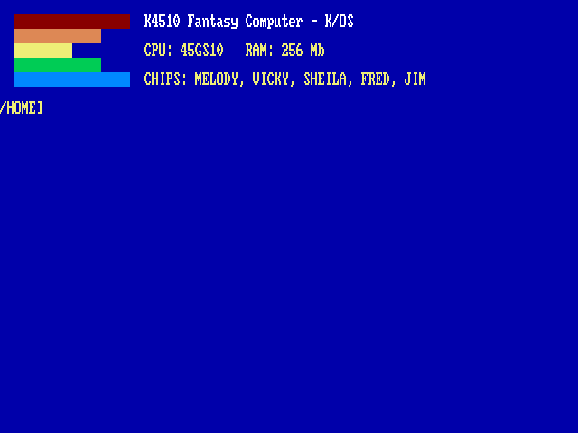
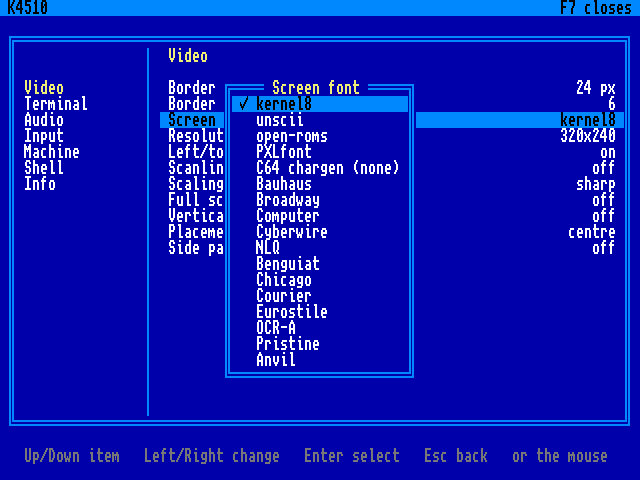

# The Machine

The K4510 is a fantasy computer: a machine that never existed, built the way 1985 might have built it with no budget committee in the room. It is not an emulation of any real computer. Its CPU, video chip, sound, and operating software are its own; the parts it borrows — a 6502-family instruction set, the AdLib’s FM chip — it borrows openly and then outgrows.

## What is the K4510?

- **CPU: the 45GS10** — the MEGA65’s 45GS02 instruction set (a 4510 with the Q pseudo-register and 32-bit flat addressing) plus this machine’s own memory management: bank registers, a far-call gate, and RAM under the ROM. Its clock is whatever the host it runs on can hold at sixty frames a second with no gaps in the sound: the machine is a fantasy and its timings are suggestions. The clock is a setting (F12, under Machine — six steps from 60 MHz down to 10; the ladder goes on to 202.5, and those faster steps are held back for now). A host nobody has measured runs at 40.5, the MEGA65’s number; `SETUP` measures it properly, with the sound and the picture really running, and the machine keeps the answer for that host so later boots pay nothing. It never second-guesses a clock you chose yourself. A desktop of the last ten years holds a hundred megahertz or more. `INFO` reports the clock in force, read live, and `BENCH` is there when you want the whole picture.

- **Memory: 256 MB**, flat, 28-bit. The CPU sees 64 KB at a time; everything else is one instruction away.

- **Video: VICKY** — 640×480, 256 colours from a 24-bit palette, four layers, 128 sprites, a blitter that draws lines and filled triangles, and a display-list coprocessor named SHEILA. Smaller modes (640×240, 320×240, 320×200, 160×200) are drawn into the same glass, doubled and centred, so the raster is always 480 lines however few of them the picture uses.

- **Sound: MELODY** — an OPL2, the Yamaha YM3812, at `$D480`: nine FM voices wired the AdLib’s way, an address port, a data port and a status register you poll. Any AdLib register list or instrument patch therefore means what it says on this machine. A four-channel sound sequencer at `$D5E0` plays through it, in the BBC Micro’s idiom, which is what BBC BASIC’s `SOUND` and Mad Pascal’s `Sound` use. A floating-point MATH unit sits beside it, which the BASICs and LOGO lean on. (The machine had four SID chips until September 2026. [Appendix C, The Sound, and What It Took](a3-sound.md) is the whole story.)

- **K/OS**: a shell with directories, in ROM — and on the disk, one word away each, seven languages: EhBASIC with graphics and sprites, Microsoft’s own BASIC of 1977, BBC BASIC on the Tube, Forth, LOGO, CP/M on a Z80, and RX, the machine’s REXX. Two compilers are one word away as well: `PAS` and `CC` turn a Pascal or C source in the directory you are standing in into a program beside it ([Chapter 13, The Linux Underneath](13-linux.md)).

## One machine, three ways to run it

The computer is the **K4510**: the 45GS10, VICKY, SHEILA, MELODY and K/OS. There is one of it. What changes is what it is standing on.

**As a whole computer, from a stick.** Write the image (`linux/build-live.sh`) to a USB stick, boot a spare laptop from it, and the machine is the machine: a minimal Debian that exists only to hold it up, loaded into RAM, keeping its settings and your files on the stick and never touching the laptop’s own drive.

**As a whole computer, installed beside another system.** `linux/install-k4510.sh` copies the same system from the stick onto a partition of a computer’s internal disk and adds it to that computer’s boot menu, so the machine is one choice of two when it starts. The other system is not changed, and the computer boots whichever of the two was used last ([Chapter 13, The Linux Underneath](13-linux.md)).

Either way, the Linux underneath is not hidden. The cross-compilers, git, an editor and a second terminal are on it, and the machine can reach them ([Chapter 13, The Linux Underneath](13-linux.md)); but it is furniture. Switch on and you are at the `/HOME]` prompt.

**As a window.** Run the same program on a Linux desktop and you get the same machine in a window, which is how it is developed and tested, and how most of the figures in this book were taken. There is also a sandboxed container flavour (`linux/podman.sh`) that is shown nothing of your computer but the display, the sound, the game controllers and one shared folder.

Same ROM bytes, same software, every way. Where the desktop window and the whole computer differ, the book says “on a desktop” or “on the K4510’s own Linux”. (Until 2026-09-07 there was also a bare-metal edition for the Raspberry Pi 3B+; it was retired so that every feature is built once. A Pi still runs the machine under Linux like any other computer; the tag `alpha-0.5` is the last tree with the bare-metal edition in it.)

## Building the machine

On a **Linux desktop**, three lines build the whole machine:

    git clone https://github.com/mlongval/k4510
    cd k4510 && ./setup.sh
    ./k4510

`setup.sh` installs the compilers and SDL2, builds everything, and runs the machine’s test suites.

### Or: the whole computer

    sudo ./linux/build-live.sh

makes the bootable image: a small Debian, the machine and its compilers, about half an hour the first time. Write it to a USB stick with `dd` and boot from it; to put it on a computer’s own disk instead, boot that computer’s usual Linux with the stick in and run `sudo ./install-k4510.sh` from it. [Chapter 13, The Linux Underneath](13-linux.md) has both.

### What it needs

The machine asks little of a computer, and most of what it asks is for the Linux under it:

<table>
<tbody>
<tr class="odd">
<td style="text-align: left;">Processor</td>
<td style="text-align: left;">64-bit x86, two cores; a Core 2 is enough to run it, and what the processor decides is only the clock <code>SETUP</code> settles on</td>
</tr>
<tr class="even">
<td style="text-align: left;">Memory</td>
<td style="text-align: left;">2 GB; 4 is comfortable. The whole system is loaded into RAM at boot (about 0.9 GB), and a running machine uses 1.7 GB in all, the emulator itself 90 MB of it</td>
</tr>
<tr class="odd">
<td style="text-align: left;">Graphics</td>
<td style="text-align: left;">any Intel or AMD chip Linux drives natively (KMS); no desktop is used</td>
</tr>
<tr class="even">
<td style="text-align: left;">Screen</td>
<td style="text-align: left;">640×480 or more</td>
</tr>
<tr class="odd">
<td style="text-align: left;">Firmware</td>
<td style="text-align: left;">UEFI or BIOS, either</td>
</tr>
<tr class="even">
<td style="text-align: left;">Storage</td>
<td style="text-align: left;">a 2 GB USB stick, or a 2 GB partition</td>
</tr>
</tbody>
</table>

In a window on a desktop it needs only what the desktop has already: SDL2 and a few hundred megabytes of memory.

## First boot

Switch it on (on a desktop: `./k4510`; otherwise, power up). The machine’s logo is on the screen while Linux starts, and then the machine greets you in yellow on blue:

The boot screen: five stepped colour bars, then the machine, its CPU, its memory and its chips — and no clock, because the machine no longer has one speed. Everything else, the clock in force included, is one <code>INFO</code> away, and <code>BANNER</code> prints this again.

The `/HOME]` at the bottom is the shell prompt — the part before the `]` is the directory you are in, and the machine starts you in `/HOME`, which is yours. Type `HELP` for the commands, `INFO` for the machine’s full self-description, and `DIR` to see your files. The first time on a new computer, type `SETUP` and let the machine measure it.

!!! note ""
    **Keys:** Escape is RUN/STOP (stops a BASIC program), Ctrl-C is STOP, Shift+Escape quits the emulator. Reset is a chord, the way it was Commodore+Restore on the C64: Super+PageUp (the Windows or Command key and PageUp) — one key cannot do it by accident. F12 opens the settings menu; F8 pauses the machine and turns the keyboard into a debugger’s. PrtSc takes a screenshot — the screen flashes, and the picture is in `shots/` beside the emulator.

## The keyboard

The keyboard is the one in front of you, and F12 → Input → *Keyboard layout* says what its keys mean: US, US-International, Canadian French, French, German, Spanish, UK or Italian — or *Host*, the first choice, which leaves the question to the desktop or Linux the machine is running on. A layout chosen here takes effect at once, with its AltGr and its dead keys: on US-intl, `'` then `e` is é, the dead key twice or before a space gives the mark itself, and a `'` or `"` before a letter that takes no accent types itself. On the K4510’s own Linux the Linux consoles follow the same choice. A letter the machine’s character set (the IBM PC’s) cannot draw is not offered. For programming, plain US has no dead keys to step round.

*Caps Lock is Ctrl*, beside it, makes the Caps Lock key a second Ctrl, where the old Unix keyboards had it; the shell’s own `CAPSLOCK` command ([Chapter 2, The Shell](02-shell.md)) is how you get capitals without it.

## The F12 menu

F12 freezes the machine and takes the whole screen, in the manner of the C64 Ultimate’s: the categories down the left, the settings of the chosen one on the right, and a line at the foot saying what the keys do in whichever pane holds the cursor. Sound stops, and closing the menu resumes exactly where it froze. The menu draws with its own copy of the font and never touches the machine’s memory, so it opens even when a program has wrecked the screen.

Up and Down move; Enter or Right crosses from the categories to the settings; Left and Right step a value; Escape goes back a pane, and closes at the categories; F12 closes from anywhere. The mouse works too. Shift+F12 pauses the machine instead, the picture held; Shift+F12 again goes on. The menu was on F7 until the autumn of 2026, a habit from the Commodore’s keyboard; most emulators keep theirs on F12, and F7 and F8 are ordinary keys now, for the programs that want all ten. Input → *Menu key* puts it back on F7 for fingers that remember. A setting with a list of choices opens that list over the panes, and *applies as the cursor passes each one* — the scaling changes under the menu so you can see it — with Escape putting back whatever was there when the list opened.

The F12 menu: categories on the left, the Video page on the right.

Video  
the border; *resolution*, which is the `MODE` command’s knob; *scaling*: *integer*, to begin with (a whole-number multiple, so every pixel is the same size on the glass, with a border where the window is not an exact multiple), or *fit to display* (as large as the window takes; the pixels may come out uneven) — both hard pixels, never blurred; full screen; *vertical sync*, off to begin with — see the aside below; and *placement* and *side panel*, which are the section after next. The figures in this book are taken with the effects off.

Terminal  
*status bands*, on or off (a row at the top, a row at the bottom) ([The status bands](02-shell.md#the-status-bands)), and the clock and date format they print.

Audio  
volume.

Input  
the reset chord; which key opens the menu; whether a click captures the mouse pointer, and whether the host’s pointer shows over the picture (full screen, the pointer stays on the machine’s picture, and goes into the side panel only when there is one); the keyboard, above; and the *key pipe*, typing from another computer ([Chapter 13, The Linux Underneath](13-linux.md)): *off*, *on*, or *on, shown* — the one it starts at — where every key typed that way is echoed in a bar at the foot of the window for a few seconds, so nobody types into the machine unseen.

Machine  
*save state* and *load state*, four slots each (the whole machine — CPU, every used page of the 256 MB, VICKY, the devices, JIM — to `k4510-slotN.k4s` beside the settings file; the Tube co-processor is not in the file and is stopped by a load); reset; power cycle; stop the Tube; quit; *CPU clock* — the steps, live, 60 MHz at the most for now; choosing one switches *Auto clock* off, because a clock chosen by hand is not to be second-guessed. *Auto clock* on uses what `SETUP` measured on this host. On the K4510’s own Linux there is a last row, *Shut down the computer*.

Shell  
whether an unknown word at the prompt may run a CP/M `.COM` ([Chapter 9, CP/M: the Z80 Second Processor](09-cpm.md)) — off to begin with, on purpose: `D` typed for `DIR` should not start a Z80 program; and whether `/STARTUP.BAT` runs at power-on, which is the way out of a bad one ([When STARTUP.BAT is the problem](02-shell.md#when-startupbat-is-the-problem)).

Info  
the version and the exact build, the ROM, the files, the host — the K4510’s own Linux, or a window on a desktop — and the battery, where there is one.

Host  
on the K4510’s own Linux only: the computer’s name, its network address and Tailscale’s; *Lid closed*, which is *keep running* to begin with — the machine goes on with the lid down — or *suspend*; a *Wi-Fi / network setup* row that opens the network settings on a spare console, and a row that telnets into the Linux for you.

Leaving the menu writes the settings to `k4510.cfg` beside `fs/` — a plain `key = value` file you may edit; comments and keys it does not know are kept, which is how a settings file survives the machine changing under it.

!!! note ""
    **Vertical sync is off, and that is deliberate.** With it off the machine keeps its own 60 Hz and presents a frame when it is ready; the cost is tearing. With it on, the pacing belongs to your display, and on a host whose refresh is not exactly 60 that costs frames — and frames are sound here ([Appendix C, The Sound, and What It Took](a3-sound.md)). Neither answer is right for every host, which is why it is a row and not a decision.

## The menu file: what the menu shows

Beside `k4510.cfg` is a second file, `k4510-menu.cfg`, and it decides not what the settings *are* but which of them the menu *offers*. The machine writes it out in full the first time it starts — every category and every row, each marked `show` — so the file is itself the list of what can be changed:

    [K4510]
    Audio                    = show
    ...
    [Video]
    Border width             = hide
    ...
    [Locks]
    linux    = open
    consoles = open

- `hide` on a row takes it out of the menu, and a category with nothing left in it goes too; `hide` under `[K4510]` takes a whole category away. A hidden setting keeps the value it has in `k4510.cfg`: it is not reset, only out of reach.

- `linux = locked` shuts every door into the Linux underneath: `!`, `SSH`, and the telnet row of the Host menu. `PAS` and `CC` still compile. `consoles = locked` makes Ctrl+Alt+F2 to F6 do nothing.

- Names are the menu’s own, in either case; `#` starts a comment; a row the file does not name is shown. The file is read when the machine starts, so a change takes effect at the next start.

The file lives outside the machine’s disk, so nothing running on the machine can undo it. On the K4510’s own Linux it is in `/home/k4510/k4510/`; once Linux is locked, edit it over ssh from another computer.

### Every row

The list below is generated from the menu’s own source, with the name each setting has in `k4510.cfg`, its choices and where it starts.

### Video

**`Border width`** — *video.border*  
0 to 64; to begin with, 0

**`Border colour`** — *video.border_colour*  
0 to 15; to begin with, 6

**`Resolution`** — *video.mode*  
640x480; to begin with, 360x270

**`Scaling`** — *video.smoothing*  
integer, fit to display; to begin with, integer

**`Full screen`** — *video.fullscreen*  
on, off; to begin with, off

**`Vertical sync`** — *video.vsync*  
on, off; to begin with, off

**`Placement`** — *video.placement*  
centre, left, right; to begin with, centre

**`Side panel`** — *video.panel*  
off, registers; to begin with, off

**`Sidebars`** — *video.sidebars*  
border, gradient, knot, halloween, christmas, space, river, dreamfall, tetris, antfarm; to begin with, border

### Terminal

**`Status bands`** — *term.bands*  
on, off; to begin with, off

**`24-hour clock`** — *term.clock24*  
on, off; to begin with, on

**`Date format`** — *term.datefmt*  
DD.MM.YYYY, YYYY-MM-DD, MM/DD/YYYY; to begin with, DD.MM.YYYY

**`Code page`** — *text.codepage*  
CP437, K4510; to begin with, CP437

### Audio

**`Volume`** — *audio.volume*  
0 to 100; to begin with, 80

### Input

**`Reset chord`** — *input.reset_chord*  
Super+PageUp, Ctrl+PageUp, Alt+PageUp, Ctrl+Alt+Del; to begin with, Super+PageUp

**`Menu key`** — *input.menu_key*  
F7, F8, F11, Pause, F12; to begin with, F12

**`Mouse capture`** — *input.mouse_grab*  
on, off; to begin with, off

**`Mouse pointer`** — *input.mouse_pointer*  
on, off; to begin with, on

**`Caps Lock is Ctrl`** — *input.caps_ctrl*  
on, off; to begin with, off

**`Keyboard layout`** — *input.kbd_layout*  
Host, US, US-intl, Canada-FR, France, Germany, Spain, UK, Italy; to begin with, Host

**`Key pipe`** — *input.keypipe*  
off, on, on, shown; to begin with, on, shown

### Machine

**`Save state`** —   
4 slots, each showing when it was written

**`Load state`** —   
4 slots, each showing when it was written

**`Reset`** —   
does it

**`Power cycle`** —   
does it

**`Stop the Tube`** —   
does it

**`Quit the emulator`** —   
does it

**`CPU clock`** — *cpu.clock*  
60 MHz, 40.5 MHz, 30 MHz, 20 MHz, 15 MHz, 10 MHz; to begin with, 40.5 MHz

**`Auto clock`** — *cpu.auto*  
on, off; to begin with, on

**`Shut down the computer`** —   
does it; only on the K4510’s own Linux

### Shell

**`CP/M .COM by name`** — *shell.cpm_com*  
on, off; to begin with, off

**`Run STARTUP.BAT`** — *shell.startup*  
on, off; to begin with, on

### Info

**`Version`** —   
shows

**`Build`** —   
shows

**`ROM`** —   
shows

**`Files`** —   
shows

**`Host`** —   
shows; only on the K4510’s own Linux

**`Battery`** —   
shows

### Host

*Only on the K4510’s own Linux.*

**`Name`** —   
shows

**`Address`** —   
shows

**`Tailscale`** —   
shows

**`Lid closed`** — *host.lid*  
keep running, suspend; to begin with, keep running

**`Wi-Fi / network setup`** —   
does it

**`Telnet into the host`** —   
does it

## Placement, the side panel, and F8

A 4:3 picture on a 16:9 screen leaves a third of the glass empty. *Placement* (centre, left, right) puts the picture against one edge instead of in the middle, and *side panel* fills what is left — at present with one thing, the machine as the emulator sees it. A panel with a centred picture makes no sense, so turning the panel on forces the picture left.

The panel is a strip twenty-six columns wide taking the whole height of the window, one fact to a line: the program counter, A X Y Z, the stack pointer, the B register, the flags, the next few instructions disassembled, VICKY’s mode and the raster line it is on, the eight bank registers with the engaged ones lit, the audio gaps, the frame counter and the frame rate. It never reads through the I/O page — a read of `$D100` would pop a key off the keyboard, and an instrument that changes what it measures is not one.

**F8 pauses the machine, and then the keyboard is the debugger’s:**

<table>
<thead>
<tr class="header">
<th style="text-align: left;"><strong>Key</strong></th>
<th style="text-align: left;"><strong>Does</strong></th>
</tr>
</thead>
<tbody>
<tr class="odd">
<td style="text-align: left;">F8</td>
<td style="text-align: left;">pause, and again to run on</td>
</tr>
<tr class="even">
<td style="text-align: left;">Space</td>
<td style="text-align: left;">one instruction</td>
</tr>
<tr class="odd">
<td style="text-align: left;"><code>L</code></td>
<td style="text-align: left;">the rest of this scanline</td>
</tr>
<tr class="even">
<td style="text-align: left;"><code>F</code></td>
<td style="text-align: left;">the rest of this frame</td>
</tr>
<tr class="odd">
<td style="text-align: left;"><code>D</code></td>
<td style="text-align: left;">write a dump — <code>dumps/dump-NNN.txt</code>, the same file <code>DUMP</code> writes, and arm the instruction recorder so the next one has history</td>
</tr>
<tr class="even">
<td style="text-align: left;"><code>T</code></td>
<td style="text-align: left;">start or stop an instruction trace to <code>/SYSTEM/LOG/TRACE.TXT</code>: one line per instruction with the registers after it, stopping itself at 200,000 lines</td>
</tr>
</tbody>
</table>

Every other key is swallowed while the machine is paused. The panel shows the legend and the state: which scanline is next, whether the trace is running and how long it is, and the number of the last dump.
