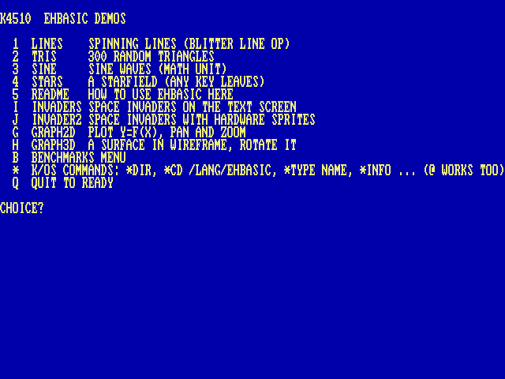
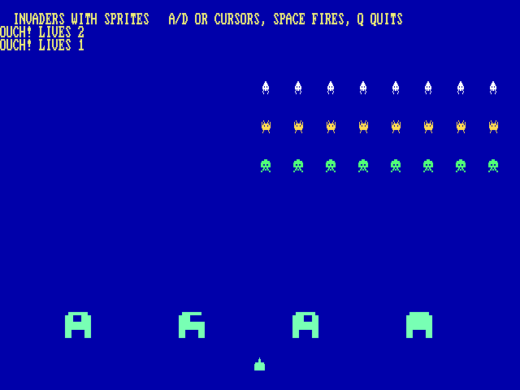

# EhBASIC

The machine has two BASICs, and this is the one with the machine in it: EhBASIC 2.22 — Lee Davison’s Enhanced BASIC — with this machine’s additions: graphics statements that ride the blitter, floating point on the MATH unit, and an escape hatch to the shell. It has no sound *keyword*: a program that wants a note pokes the sound sequencer at `$D5E0` or the OPL2 at `$D480` directly, which on a machine with a friendly memory map is not much of a hardship ([Chapter 15, The I/O Page](21-io.md)). The other BASIC, Microsoft’s own, has none of this and is proud of it ([Chapter 5, Microsoft BASIC, 1977](05-msbasic.md)).

    RUN EHBASIC

It comes up ready: the banner, `47103 Bytes free` — more than twenty-one C64s more than a C64 — and a `Ready` prompt — the traditional `Memory size ?` question is gone; the machine knows.

## Ten minutes of it

    RUN "DEMOS.BAS"

The demo menu. A key picks an entry; each demo returns here when it ends.

The menu chains: `RUN "name"` (or `LOAD` inside a running program) loads another BASIC program and runs it — that is how one BASIC program hands over to another, exactly as on a C64.

## The machine’s own statements

    GRAPHICS 2          640x480 bitmap over the text
    PLOT X,Y,C          LINE X1,Y1,X2,Y2,C
    TRI X1,Y1,X2,Y2,X3,Y3,C
    PALETTE I,R,G,B     GCLS            GRAPHICS 0

Colours 0–15 belong to the text screen; demos use 16 and up. `GRAPHICS 0` puts the text mode and its palette back, whatever the program changed.

## Hardware sprites

The 128 sprites VICKY carries are reachable from BASIC, which is unusual enough to be worth saying plainly: this is not a bitmap being redrawn, it is the video chip carrying the picture for you.

    SPRDEF n,page,w,h,bpp   give sprite n a shape
    SPRITE n,x,y            put it there and show it
    SPROFF n                hide it

`SPRDEF` says where the pixels are and what shape they make: *page* is the 256-byte page the data starts at, which is how a 16-bit BASIC number reaches into 256 MB (`page*256` is the address); *w* and *h* are 8, 16, 32 or 64; *bpp* is 4 or 8. `SPRITE` positions the sprite and turns it on, `SPROFF` hides it. Colour 0 is transparent, and there is no per-line limit — all 128 may be on the same raster line.

Each statement re-points the chip at the attribute table and re-enables sprites, so a `GRAPHICS 0` or a shell `MODE` in between costs you nothing: the next sprite statement puts them back.

`INVADER2.BAS` in `/LANG/EHBASIC/EX` is the demonstration — Space Invaders with the arcade shapes, poked 4 bits-per-pixel into \$040000 through a bank register, four bases that erode as they are hit, and thirty-one sprites moving. `INVADERS.BAS` beside it is the same game on the text screen, which is a fair way to see what the sprites buy you.

<code>INVADER2.BAS</code>: twenty-four invaders, four bases and a cannon, every one of them a hardware sprite. The bases erode because their shape pages are poked, not redrawn.

## The \* escape

Any shell command works from BASIC with `*` in front — `*DIR`, `*CD EHBASIC`, `*MON`, `*DUMP a note` — and `*BYE` leaves BASIC for the shell. Escape or Ctrl-C stops a running program (and silences the sound); the program’s variables survive for `PRINT`-style post-mortems.

## Editing the program in VI

`*VI` and `*EDIT`, with nothing after them, edit the program that is in memory:

    10 PRINT "HELLO"
    *VI

BASIC writes the program to a temp file, opens the editor on it, and reads it back when you leave — so what you type in the editor is what you `LIST` afterwards. Give either one a file name and nothing special happens: `*VI notes.txt` is the ordinary `*` escape, and the editor edits that file.

The trip out and back is not free. The editors load where the interpreter lives, so the shell command underneath is `SWAP`, which puts all 64 KB and the screen aside first and restores them afterwards. And because the program is written out and read back, *variables do not survive* — this is an immediate-mode thing, like `LOAD`. The temp file (`EDITTMP.BAS`) is left behind, which is occasionally a useful accident.

!!! note ""
    **Why the first line is blank:** `SAVE` starts its output with a newline, so the editor opens on an empty line 1 with the program below it. Harmless — BASIC ignores it on the way back in — but it is why the line count is one more than you expect.
