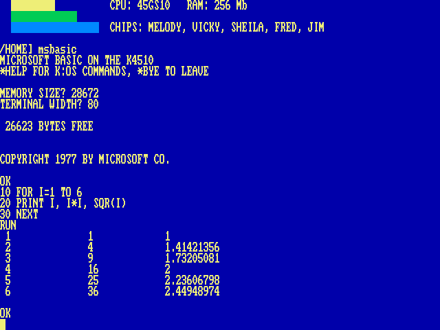

# Microsoft BASIC, 1977

EhBASIC is the BASIC with the machine in it. This is the other one, and it is the real thing:

    MSBASIC

Microsoft’s 6502 BASIC — not an imitation of it, but the source Microsoft released in 2025, assembled in a *pure* configuration: the newest base in the tree, nine-digit floating point, every fix through revision 2C, and none of the additions any particular manufacturer made to it. It is the interpreter that became Commodore’s and Apple’s before either of them touched it, and it is here because a fantasy machine of the mid-eighties would have been sold one. Not a byte of Microsoft’s source is changed: everything the machine adds is caught a level below the interpreter, where the keyboard and the screen come in, so the BASIC never knows.

Microsoft BASIC: its own banner, the memory the machine gave it, and a program run.

It loads at `$7000`, comes up with its own banner, and gives you its famous prompt: `OK`. It answers the `MEMORY SIZE?` question itself — a pure Microsoft cold start asks where memory ends and, given no answer, finds out by walking upwards, straight through its own image — so you start with a program area of 26 KB.

## Saving and loading

Microsoft left `SAVE` and `LOAD` to each manufacturer, and every one of them wrote their own. These are the K4510’s:

    SAVE "HELLO"
    LOAD "HELLO"

A program is kept as *text*: `HELLO.BAS` is its `LIST`, word for word, in the directory you are standing in. `.BAS` is added to a name without a dot. That makes the file something every other program on the machine can read — `TYPE` shows it, VI edits it, you can write one on the host — and loading it is exactly as if it were being typed at the keyboard, only faster and without the echo. `SAVE` and `LOAD` with no name use the last name you gave, which is `PROGRAM.BAS` until you have given one. `LOAD` of a file that is not there says `?FILE NOT FOUND` and leaves the program you had alone; `SAVE` inside a running program ends it, as `LIST` does.

## The \* escape

A line beginning with `*` typed at the `OK` prompt is not BASIC’s but K/OS’s: `*DIR`, `*CD`, `*TYPE`, any command in [Chapter 3, Every Command](03-commands.md). A program started this way runs on a clean machine and gives BASIC back as it was — the command underneath is `SWAP -k` ([Chapter 2, The Shell](02-shell.md)). A `*` typed at an `INPUT` prompt is data, not a command.

Three words are BASIC’s own:

`*BYE` (or `*QUIT`)  
hands the machine back to the shell, its directory and its screen intact. Microsoft’s BASIC has no way out of its own, so this one is built underneath it.

`*VI`  
edits the program in memory: it is saved under its name, VI opens on it, and when you leave VI it is loaded back. So what you type in the editor is what you `LIST` afterwards. Variables do not survive the round trip, as with any `LOAD`; if the save fails, nothing else happens. `*VI name` with a name is the ordinary shell command, and edits that file.

`*HELP`  
says the two things above, then prints the shell’s own command summary.

## What it does not have

**Sound, graphics, sprites:** none, and it is not going to grow any. Adding keywords means editing Microsoft’s interpreter, which is the one thing this port does not do. A program that wants a colour or a note can `POKE` the chips directly ([Chapter 15, The I/O Page](21-io.md)); for anything more, EhBASIC is next door.

**The arrow keys** do not edit the line you are typing: Microsoft’s line input of 1977 had no cursor to move. They are ignored there, so an arrow typed by habit leaves no stray character, and a program that reads the keyboard with `GET` still receives them.
