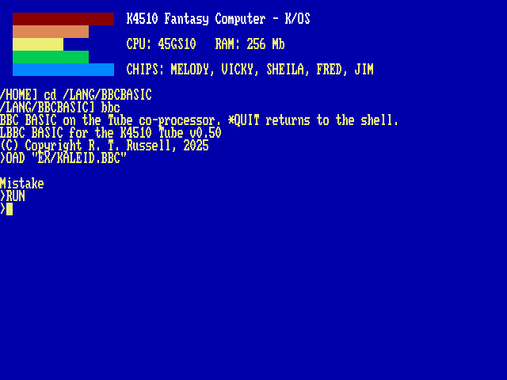
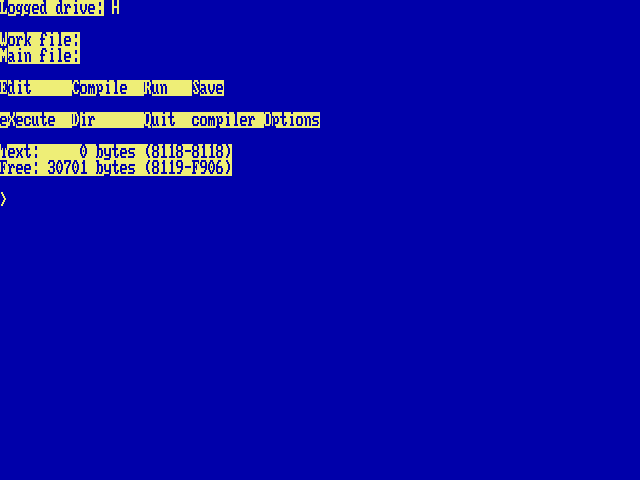

# The Tube

The BBC Micro’s most elegant idea was the Tube: a fast port through which a *second processor* — another CPU with its own memory — could take over the computation while the Beeb kept the keyboard, the screen and the discs. The K4510 has a Tube of its own at `$D800`, and the first thing fitted to it was Richard Russell’s BBC BASIC, running on the host machine with a flat 256 MB of its own. Others have followed: CP/M on a Z80 ([Chapter 9, CP/M: the Z80 Second Processor](09-cpm.md)), the host’s own shell behind `!`, a chess engine, and — since 2026 — DOOM.

    BBC

You get the `>` prompt of a BASIC with real power behind it, and it is *fast* — the co-processor is not cycle-matched to 1985:

    HIMEM=PAGE+250*1024*1024
    DIM space 200*1024*1024

both just work. Type `*QUIT` to hand the console back to the shell.

## DOOM

    DOOM

takes the Tube, and the machine’s bitmap fills with something no 8-bit computer ever showed. Arrows turn, `W` and `S` walk, `A` and `D` strafe, Ctrl fires, Space opens doors, Shift runs, Tab is the map, `[` and `]` change weapons, and Escape is the menu. Quitting from DOOM’s own menu hands the console back.

The game data does not ship with the machine: an IWAD is 28 MB and the whole machine layer an update carries is under 6. On the host, `tools/ get-freedoom.sh` fetches *Freedoom* — a BSD-licensed replacement for id’s data, built over twenty years to run on this engine — into `/APPS/DOOM`. Any IWAD the engine accepts will do, including your own.

!!! note ""
    **This is DOOM *displayed on* VICKY, not DOOM *running on* a 45GS10.** Like everything on the Tube it runs on the host beneath the machine: the co-processor draws DOOM’s own 320×200 paletted frame, the machine shows it doubled on its bitmap, and the keys travel back the other way. A 45GS10 at 60 MHz could not run DOOM, and nothing here claims it can. What is genuinely the machine’s is the screen it appears on — the same 8-bit bitmap and the same 256-entry palette that BBC BASIC’s `PLOT` draws into.

The pixels take a different road from everything else on the Tube. BBC BASIC’s graphics arrive as escape sequences and the Tube ULA executes them; DOOM cannot work that way, because a frame is 64 KB and there are 35 of them a second. So the co-processor and the host share a piece of memory: the frames go up it, and — this is the part that matters — the keys go *down* it. A terminal carries keystrokes but never releases, and a player who cannot stop walking is a player who walks into a wall for ever.

## Graphics and sound

The console cannot show what it cannot see, so the Tube speaks up: MODE, GCOL, PLOT, MOVE, DRAW, CIRCLE and the palette arrive at the machine as escape sequences, and the Tube’s gatekeeper (the *Tube ULA*) executes them on the VICKY blitter. `SOUND` and `ENVELOPE`-less music go the same way, onto the machine’s four-channel sound sequencer and out through the OPL2 — the classic Beeb `SOUND chan,amp,pitch,dur`, queued per channel like the original. Channel 0, which was the Beeb’s noise, is a feedback-heavy FM patch; 1 to 3 are plain two-operator tones. The patch is written again on every note, so a program that has zeroed the chip for its own purposes does not silence the sequencer.

    CD /LANG/BBCBASIC
    BBC
    LOAD "EX/KALEID.BBC"
    RUN

<code>KALEID.BBC</code>: MODE 2 kaleidoscope, drawn by BBC BASIC on the Tube, painted by VICKY.

The `/LANG/BBCBASIC/EX` directory carries a period programme selection: `KALEID`, `CIRCLES`, `ROSES`, `MOUNTAIN`, `BOUNCE`, `CLOCK` (a live analogue clock face) and `TUNE` — Frère Jacques as a three-voice round, the sound sequencer’s party piece.

## Sprites

VICKY has 128 hardware sprites, and BBC BASIC reaches them the way RISC OS reached its own: `VDU 23,27` selects and shapes, `PLOT &ED` places. There is no sprite file. A sprite is *captured* from the bitmap after BBC BASIC has drawn it with the words it already knows:

    MODE 2
    GCOL 0,1:CIRCLE FILL 40,40,30
    MOVE 8,6:VDU 23,27,1,0,32,32|
    CLG
    PLOT &ED,600,500

<table>
<tbody>
<tr class="odd">
<td style="text-align: left;"><code>VDU 23,27,0,n</code>|</td>
<td style="text-align: left;">select sprite n (0–127) for PLOT</td>
</tr>
<tr class="even">
<td style="text-align: left;"><code>VDU 23,27,1,n,w,h</code>|</td>
<td style="text-align: left;">capture n, w× h pixels (8/16/32/64), bottom-left at the graphics cursor</td>
</tr>
<tr class="odd">
<td style="text-align: left;"><code>VDU 23,27,2,n</code>|</td>
<td style="text-align: left;">hide n</td>
</tr>
<tr class="even">
<td style="text-align: left;"><code>VDU 23,27,3,n,f</code>|</td>
<td style="text-align: left;">flip: bit 0 horizontal, bit 1 vertical</td>
</tr>
<tr class="odd">
<td style="text-align: left;"><code>VDU 23,27,4,n,z</code>|</td>
<td style="text-align: left;">depth: drawn after layer z (default 1, over the bitmap)</td>
</tr>
<tr class="even">
<td style="text-align: left;"><code>VDU 23,27,5,n,m</code>|</td>
<td style="text-align: left;">sprite n shows sprite m’s picture</td>
</tr>
<tr class="odd">
<td style="text-align: left;"><code>PLOT &amp;ED,x,y</code></td>
<td style="text-align: left;">show the selected sprite, bottom-left at x,y</td>
</tr>
</tbody>
</table>

A placed sprite is a register write: moving sixty-four of them every frame costs the interpreter nothing but the PLOTs. `SPRITES.BBC`, `INVADERS.BBC` and `TUNNEL.BBC` beside them are the demonstrations (the last one moves nothing at all — it cycles the palette with `VDU 19`).

## The terminal: JIM

The console you see when the Tube is running is not the ROM’s own terminal but *JIM*, at `$DA00` — the Beeb’s third I/O page, given a job here. JIM is a VT100 with the ANSI colours and the VT220 editing sequences (insert and delete character and line, erase character, scroll regions, origin mode, DEC line drawing, cursor-position and identity reports), built into the machine the way a real 8-bit computer got a serious terminal: as a card, not a program. It draws on the same text screen as the ROM console, inside the window the ROM gives it, so the two share one screen and one cursor. Anything that needs a terminal writes its byte stream to `$DA00` and reads its answers from `$DA02`; keys pushed through `$DA03` come back as the VT sequences the far end expects (arrows, Home/End, PgUp/PgDn, F1–F12, Delete as `$7F`). The register map is in `core/term.h`.

Turbo Pascal 3 (<code>H:</code> user 3) on JIM: the menu bar in reverse video, the compiler’s own screen handling on a VT100 that is a chip.

For CP/M this settles the question every program asks at install time: tell WordStar’s `WSCHANGE`, Turbo Pascal’s `TINST`, ZDE and the rest that the terminal is a *VT100* (or *ANSI*: the same sequences). Turbo Pascal 3 on `H:` user 3 comes up with its menu already right; WordStar 4 on `E:` wants one pass of `WSCHANGE`. BBC BASIC’s console edition speaks the same language natively, so `COLOUR`, `CLS` and `PRINT TAB(x,y)` land where they should. Bytes `$80`–`$FF` are drawn as CP437 glyphs, which is what BBS ANSI art is made of.

## Star commands

A line starting with `*` goes to the machine: `*DIR`, `*CD`, any shell command — and BBC BASIC’s own file words (`LOAD`, `SAVE`) read and write the machine’s filesystem directly, because the co-processor lives inside `fs/` too. The Tube starts in the shell’s current directory, so `CD /LANG/BBCBASIC` then `BBC` lets `LOAD "EX/KALEID.BBC"` work without spelling the whole path; the machine’s filesystem is the co-processor’s whole world — `fs/` is shown as `/`, the host tree above it hidden, and `*CD ..` stops at the root.

`*VI` or `*EDIT` with nothing after it edits the program in memory, as in the other BASICs: BBC BASIC lists it as text to `EDITTMP.BBC` in the current directory, the editor opens on it, and when you leave, `LOAD "EDITTMP.BBC"` types itself and reads it back. Variables go the way they go with any `LOAD`. With a name (`*VI NOTES.TXT`) it is the ordinary star command.

!!! note ""
    **Edges, honestly:** `POINT(` and `TINT` are not implemented; `GCOL` modes 1–4 draw plain; `VDU 5` text prints as text.
