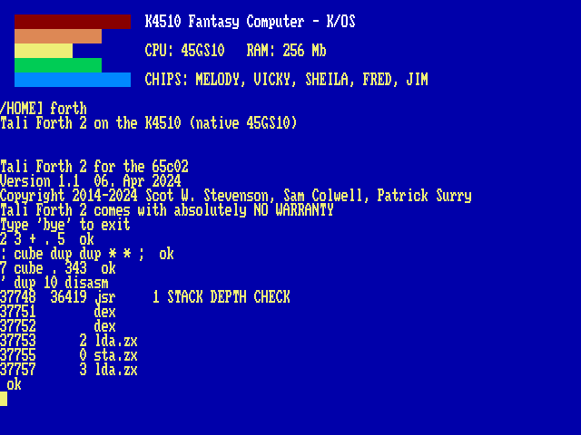

# Forth

The machine’s third language is native: no Tube, no co-processor, just 45GS10 machine code loaded at `$8C00`, with the dictionary below it. It is Tali Forth 2 — a public-domain, ANS-flavoured Forth written for the 65C02, which this CPU speaks as a strict superset.

    FORTH

    2 3 + . 5  ok
    : cube dup dup * * ;  ok
    7 cube . 343  ok

A Forth session: the banner, arithmetic, a new word, and the kernel disassembling itself.

## The machine at your fingertips

Forth’s oldest habit is poking hardware, and this machine is one large, friendly memory map. `C@` and `C!` reach every register of [Chapter 13, The I/O Page](21-io.md) directly:

    hex
    D000 C@ .            read a VICKY register
    D5E0 80 swap C!      silence the sound sequencer by hand

## The assembler

Tali brings an interactive 65C02 assembler and a disassembler, kept in because on this machine they are the point:

    ' dup 10 disasm      disassemble a word of the kernel
    assembler-wordlist >order
    here  2 lda.#  0 sta.z  drop

`DISASM` is strictly 65C02: at a 45GS10-only opcode it prints a polite `?` and moves on.

## Manners

The dictionary has about 31.7 KB free for your words. `BYE` returns to the shell with the screen and the session exactly as you left them.

!!! note ""
    No file words yet: Forth source lives in `/LANG/FORTH` but must be typed. An `INCLUDED` that reads through the machine’s storage device is on the list.
