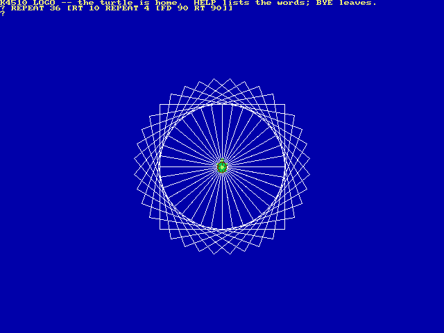

# LOGO

LOGO is the language that taught a generation of children that a computer does what it is told, and it did it with a turtle: a small arrow on the screen that walks forward, turns, and leaves a line behind it. The K4510’s is new, written for this machine in September 2026, and native — 45GS10 code, no co-processor.

    LOGO
    FD 100 RT 90
    REPEAT 4 [FD 100 RT 90]

LOGO: a square repeated round a circle, drawn by the blitter under the console’s text.

The picture is VICKY’s 640×480 bitmap *under* the console, which is the classic LOGO screen: the turtle draws below and the prompt lives above, so you can see what you asked for and what you are asking next at once. The turtle itself is a small green turtle, a hardware sprite in sixteen headings — one every 22.5 degrees, drawn once and turned by `tools/mkturtle.py` when the machine is built, so turning it is a matter of pointing the sprite at the right picture. LOGO puts the console into 640×480 for the session, as EhBASIC’s `GRAPHICS 2` does, and back into the mode it found at `BYE`. Every line is the blitter’s, and every number is a real one — IEEE floating point, done by the MATH unit, so a heading is an angle and `SQRT 2` is what it should be.

## The words

<table>
<tbody>
<tr class="odd">
<td style="text-align: left;"><code>FD n</code>, <code>BK n</code></td>
<td style="text-align: left;">forward, back</td>
</tr>
<tr class="even">
<td style="text-align: left;"><code>RT n</code>, <code>LT n</code></td>
<td style="text-align: left;">right, left, in degrees</td>
</tr>
<tr class="odd">
<td style="text-align: left;"><code>PU</code>, <code>PD</code></td>
<td style="text-align: left;">pen up, pen down</td>
</tr>
<tr class="even">
<td style="text-align: left;"><code>HT</code>, <code>ST</code></td>
<td style="text-align: left;">hide, show the turtle</td>
</tr>
<tr class="odd">
<td style="text-align: left;"><code>HOME</code>, <code>CS</code></td>
<td style="text-align: left;">to the centre; clear the screen as well</td>
</tr>
<tr class="even">
<td style="text-align: left;"><code>SETXY x y</code></td>
<td style="text-align: left;">put it somewhere</td>
</tr>
<tr class="odd">
<td style="text-align: left;"><code>SETX</code>, <code>SETY</code>, <code>SETH</code></td>
<td style="text-align: left;">one coordinate, or the heading</td>
</tr>
<tr class="even">
<td style="text-align: left;"><code>SETPC n</code></td>
<td style="text-align: left;">the pen’s colour</td>
</tr>
<tr class="odd">
<td style="text-align: left;"><code>FILL</code></td>
<td style="text-align: left;">paint the area under the turtle</td>
</tr>
<tr class="even">
<td style="text-align: left;"><code>XCOR</code>, <code>YCOR</code>, <code>HEADING</code></td>
<td style="text-align: left;">where it is</td>
</tr>
<tr class="odd">
<td style="text-align: left;"><code>REPEAT n […]</code></td>
<td style="text-align: left;">do it n times; <code>REPCOUNT</code> says which time this is</td>
</tr>
<tr class="even">
<td style="text-align: left;"><code>IF c […]</code></td>
<td style="text-align: left;">decide</td>
</tr>
<tr class="odd">
<td style="text-align: left;"><code>IFELSE c […] […]</code></td>
<td style="text-align: left;">decide between two</td>
</tr>
<tr class="even">
<td style="text-align: left;"><code>MAKE "x expr</code>, <code>:x</code></td>
<td style="text-align: left;">a variable, and its value</td>
</tr>
<tr class="odd">
<td style="text-align: left;"><code>PRINT</code>, <code>SHOW</code></td>
<td style="text-align: left;">print a value</td>
</tr>
<tr class="even">
<td style="text-align: left;"><code>RANDOM</code>, <code>SQRT</code>, <code>SIN</code>, <code>COS</code>, <code>INT</code>, <code>ABS</code></td>
<td style="text-align: left;">numbers</td>
</tr>
<tr class="odd">
<td style="text-align: left;"><code>TO name :a … END</code></td>
<td style="text-align: left;">a procedure; <code>STOP</code> and <code>OUTPUT</code> leave it</td>
</tr>
<tr class="even">
<td style="text-align: left;"><code>LOAD "name</code></td>
<td style="text-align: left;">run a <code>.LGO</code> file</td>
</tr>
<tr class="odd">
<td style="text-align: left;"><code>EDIT "name</code></td>
<td style="text-align: left;">edit one in VI, then run it</td>
</tr>
<tr class="even">
<td style="text-align: left;"><code>HELP</code>, <code>BYE</code></td>
<td style="text-align: left;">the words; back to K/OS</td>
</tr>
</tbody>
</table>

## Procedures

A procedure is a new word, and it may call itself:

    TO TREE :N
      IF :N < 5 [STOP]
      FD :N LT 30 TREE :N * 0.7
      RT 60 TREE :N * 0.7
      LT 30 BK :N
    END
    TREE 80

A procedure’s inputs are its own; `MAKE` writes the nearest variable of that name, or makes a global one. Recursion is real and goes deep — deep enough for any tree — and a procedure that recurses for ever says so rather than taking the machine with it.

## Files

`LOAD "TREE` runs `TREE.LGO` from the directory you are in, or from the examples in `/LANG/LOGO/EX`: `SQUARE`, `SPIRAL`, `TREE` and `SNOW`. `EDIT "MINE` opens `MINE.LGO` in VI ([Chapter 11, The Editors](11-editors.md)) and runs it when you leave the editor, which is the way to write anything longer than a line. A `.LGO` file is plain text, one line as you would type it after another.
