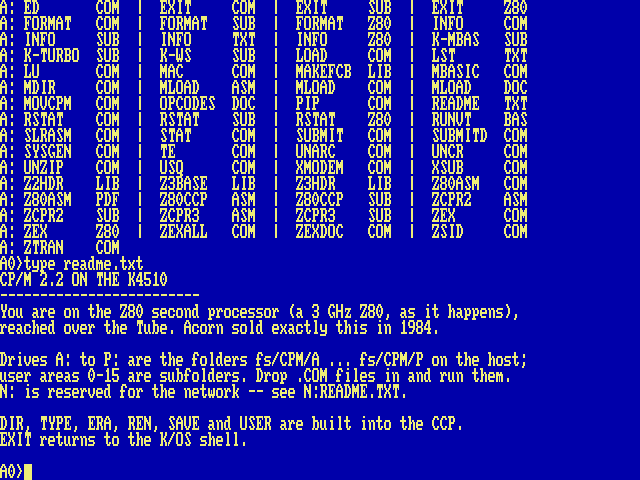
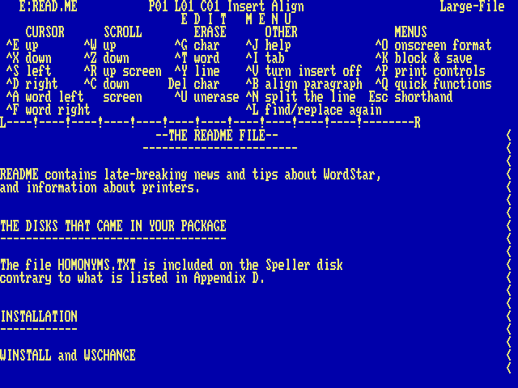

# CP/M: the Z80 Second Processor

In 1984 Acorn sold a Z80 Second Processor for the BBC Micro; its purpose was to run CP/M, the operating system that owned business computing before the IBM PC. It sat on the Tube. So does ours. `CPM` at the shell boots CP/M 2.2 on a Z80 co-processor (RunCPM, on the host), and the `A0>` prompt that defined a decade appears. The boot banner cheerfully measures the Z80 in *gigahertz* — read that number knowingly: it is the emulated Z80’s speed *on whatever host you run the emulator on* (a laptop, in this book’s screenshots), so it varies machine to machine. For scale, the real thing shipped at 4 MHz.

    CPM

CP/M 2.2 over the Tube: the CCP’s <code>DIR</code> and <code>TYPE</code>, on drive A.

## Drives are folders

Drives `A:` to `P:` are the host folders `fs/CPM/A` through `fs/CPM/P`; CP/M’s user areas 0–15 are numbered subfolders. Drop any `.COM` file into `fs/CPM/A/0` and run it by name. `DIR`, `TYPE`, `ERA`, `REN`, `SAVE` and `USER` are built into the CCP; `EXIT` hands the console back to the K/OS shell. Ctrl-C stops a running CP/M program that is listening for it, as it did in 1978 — an `MBASIC` loop, say.

Three of the drives are shortcuts rather than folders of their own: `K:` is the machine’s own filesystem, so CP/M and K/OS can hand files to each other in both directions; `P:` is Turbo Pascal and `D:` is WordStar, each pointing straight at the user area the program lives in.

And one drive letter is spoken for: `N:` is the network, reserved and empty. It is one letter and not two because on this machine the scheme lives in the *name* rather than in the device — FujiNet and Meatloaf are two URL schemes over one namespace, not two kinds of place — so `N:` will be a mount point showing whatever the shell’s `CD tnfs://` has the machine looking at. The plumbing is not written; the letter is held so that nothing else takes it.

## Starting a program from the shell

`CPM` on its own gives you the `A0>` prompt. `CPM command` runs a command at boot instead, through the CCP’s `AUTOEXEC.TXT`. One line is all the CCP reads — but a name with no `.COM` to match runs the `.SUB` of that name, and that may be as long as you like. `/CPM/A/0/K-TURBO.SUB` is the pattern:

    P:
    TURBO
    EXIT

Ending in `EXIT` is what makes the round trip whole: quitting a CP/M program only drops you to the CCP, and the `EXIT` carries you the rest of the way back to the K/OS prompt. With that in place `ALIAS TURBO CPM K-TURBO` makes `TURBO` a word you can type at the shell; `/SYSTEM/ETC/STARTUP.SAMPLE` defines that one, `WS` and `MBASIC`.

!!! note ""
    **Why not `USER` in a submit.** The obvious script is `H:`, `USER 3`, `TURBO` — and it dies on the second line. The submit in progress is a file, `$$$.SUB`, and it lives on A: user 0; `USER 3` walks away from it and it cannot be read any more. That is CP/M’s own behaviour and not RunCPM’s doing. Pointing a drive at the user area, as `P:` and `D:` do, keeps `USER` out of it.

## Typing a CP/M program’s name directly

The shell can be told to treat an unknown word as a CP/M program: F12 → Shell → *CP/M .COM by name*. With it on, `STAT` at the `/]` prompt starts CP/M, runs `STAT.COM` from A: and comes back.

It is off to begin with, and deliberately so — `D` typed for `DIR` should not start a Z80 program. It changes only the guess: a command naming `CPM` outright, an alias among them, works either way. There is nothing in a `.prg` to tell the two apart, incidentally — its header is a load address and a run address, and a `.COM` begins with Z80 code that would read as a perfectly plausible one — so the extension is what decides.

## Software

The RunCPM project ships a complete system disk (`DISK/A0.zip` in its repository): Digital Research’s own `ASM`, `MAC`, `DDT`, `ZSID`, `STAT`, `PIP` and `ED`, the `SUBMIT` batch system, Microsoft BASIC, a Z80 assembler with its manual, XMODEM, and the source code of the BDOS and CCP — buildable on the machine itself. One `unzip A0.zip -d fs/CPM/` installs the lot. Beyond that lies the whole surviving CP/M software world: WordStar, Turbo Pascal, dBase II, Zork, one archive away.

!!! note ""
    **Edges, honestly:** line-mode programs (assemblers, compilers, MBASIC, adventures) work today, and so does the full-screen software: the console is JIM, a VT100 in hardware ([Chapter 6, The Tube: BBC BASIC](06-tube.md)). WordStar 4 on `E:` user 3 comes installed for “ANSI Standard” at 79×29 — `WS` and you are editing; Turbo Pascal 3 on `H:` user 3 needs nothing either. A program that asks its terminal type at install time wants “VT100” or “ANSI”.
    
    The four arrow keys work in CP/M software: while the Tube is running CP/M the machine sends them down as the WordStar keys — Ctrl-E, X, S and D for up, down, left and right — which is what the programs of 1984 read, WordStar and Turbo Pascal ([Chapter 10, Pascal](10-pascal.md)) among them. The rest of the navigation keys do not: Home, End, PgUp and PgDn are two-key `^Q` sequences in WordStar, and there is no single key the machine could honestly send for them, so type those as the program’s manual says.
    
    

WordStar 4 editing its own <code>READ.ME</code>: the edit menu, the ruler, the text — 79×29 on JIM.

