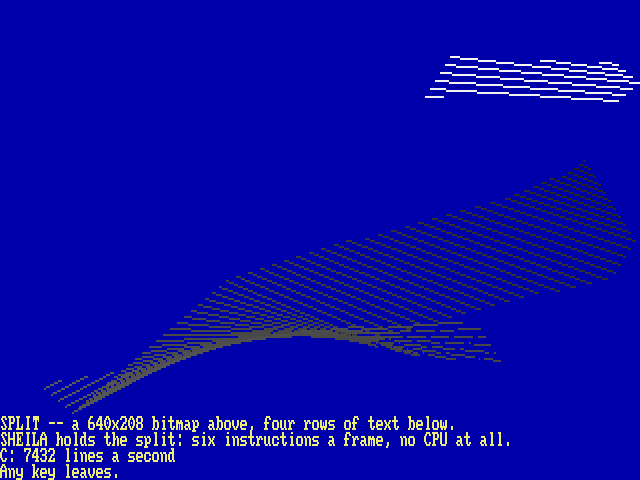

# The I/O Page

One page, `$D000-$DFFF`, always visible. The authoritative register-level reference is the machine’s own headers, and [Appendix A, The Registers](a1-registers.md) is generated from them at build time — the way the Neo6502 handbook generates its keyword reference from the firmware source. This chapter is the map of what lives where:

<table>
<tbody>
<tr class="odd">
<td style="text-align: left;"><code>$D000</code></td>
<td style="text-align: left;">VICKY</td>
<td style="text-align: left;">video: layers, palette, blitter, sprites, SHEILA</td>
</tr>
<tr class="even">
<td style="text-align: left;"><code>$D100</code></td>
<td style="text-align: left;">input</td>
<td style="text-align: left;">keyboard FIFO and its status, the held keys, the mouse, break-pending</td>
</tr>
<tr class="odd">
<td style="text-align: left;"><code>$D200</code></td>
<td style="text-align: left;">DMA</td>
<td style="text-align: left;">copy / fill / swap / line / triangle</td>
</tr>
<tr class="even">
<td style="text-align: left;"><code>$D300</code></td>
<td style="text-align: left;">storage</td>
<td style="text-align: left;">the host filesystem: open, read, dir, chdir…</td>
</tr>
<tr class="odd">
<td style="text-align: left;"><code>$D480</code></td>
<td style="text-align: left;">OPL2</td>
<td style="text-align: left;">the YM3812: address, data, status — the AdLib’s arrangement</td>
</tr>
<tr class="even">
<td style="text-align: left;"><code>$D500</code></td>
<td style="text-align: left;">system</td>
<td style="text-align: left;">clock, RTC, frame counter, DUMP, the settings the ROM reads, the sound sequencer at <code>$D5E0</code></td>
</tr>
<tr class="odd">
<td style="text-align: left;"><code>$D600</code></td>
<td style="text-align: left;">banks</td>
<td style="text-align: left;">the eight bank registers, masks at <code>$D620</code></td>
</tr>
<tr class="even">
<td style="text-align: left;"><code>$D700</code></td>
<td style="text-align: left;">MATH</td>
<td style="text-align: left;">IEEE floats, transcendentals, math lists, mul/div</td>
</tr>
<tr class="odd">
<td style="text-align: left;"><code>$D800</code></td>
<td style="text-align: left;">Tube</td>
<td style="text-align: left;">the co-processor: status, byte in, byte out, start/stop</td>
</tr>
<tr class="even">
<td style="text-align: left;"><code>$D900</code></td>
<td style="text-align: left;">N:</td>
<td style="text-align: left;">the network: four channels, tcp://, http(s):// and tnfs:// (see <code>core/net.h</code>)</td>
</tr>
<tr class="odd">
<td style="text-align: left;"><code>$DA00</code></td>
<td style="text-align: left;">JIM</td>
<td style="text-align: left;">the terminal: a VT100/ANSI in hardware, drawing on the console’s screen (see <code>core/term.h</code>)</td>
</tr>
<tr class="even">
<td style="text-align: left;"><code>$DF00</code></td>
<td style="text-align: left;">far gate</td>
<td style="text-align: left;">call slots, descriptor table pointer, depth</td>
</tr>
</tbody>
</table>

## A split screen: SHEILA

The Apple II put four lines of text under its graphics; C64 programmers did the same with a raster interrupt timed to the line. On this machine the CPU does nothing at all: SHEILA, VICKY’s display-list coprocessor (the Amiga’s copper is its ancestor), runs a short list from memory at every frame, in step with the raster, and a register it writes takes effect on the line about to be drawn. A split is six instructions:

    MOVE 10,00     line 0: layer 0, the console's text, off
    MOVE 20,19     layer 1, a 640-wide 8 bpp bitmap, on
    WAIT 416         26 text rows of 16 lines: the split
    MOVE 20,00     the bitmap off
    MOVE 10,07     the text on: rows 26-29 are text
    END              and again from the top, next frame

Each instruction is four bytes — the operation (`1` WAIT, `2` MOVE, `0` END), then its operands — and the list is anywhere in memory, a 28-bit address in `$D060`–`$D063`, started by `1` in `$D064`. A MOVE is exactly a write by the CPU, so any VICKY register can change mid-frame: the mode, the scroll, a layer, the palette. Two rules: line numbers count the glass, 0–479, whatever the mode (in a 240-line mode each line is drawn twice, so split on an even one); and **nothing turns SHEILA off after a program**, so a program that turns it on turns it off when it leaves.

<code>SPLIT</code>: blitter lines above, the console’s last four rows below, and SHEILA holding the line between them.

`SPLIT` is the demonstration, and it has two twins that draw the same ribbon of lines — endpoints bouncing, the line sixteen behind erased — as fast as they can, and say how fast in the text band: `/LANG/EHBASIC/EX/SPLIT.BAS`, with EhBASIC’s own `LINE`, and `/LANG/MSBASIC/SPLIT.BAS`, where Microsoft BASIC, which has no graphics words, sets the blitter’s registers with `POKE`. At the 40.5 MHz a host starts at:

<table>
<thead>
<tr class="header">
<th style="text-align: left;"><strong>Language</strong></th>
<th style="text-align: left;"><strong>lines/s</strong></th>
<th style="text-align: left;"><strong>how it draws one</strong></th>
</tr>
</thead>
<tbody>
<tr class="odd">
<td style="text-align: left;">C (<code>SPLIT</code>)</td>
<td style="text-align: left;">7400</td>
<td style="text-align: left;">fifteen register writes</td>
</tr>
<tr class="even">
<td style="text-align: left;">EhBASIC</td>
<td style="text-align: left;">330</td>
<td style="text-align: left;"><code>LINE</code>, one blitter operation</td>
</tr>
<tr class="odd">
<td style="text-align: left;">Microsoft BASIC</td>
<td style="text-align: left;">140</td>
<td style="text-align: left;">ten <code>POKE</code>s in a subroutine</td>
</tr>
</tbody>
</table>

The blitter draws a line in no time at all, so the numbers are the languages: what a BASIC spends is its own arithmetic, its arrays and its line lookups, and three hundred lines a second is a good deal more than a game of 1985 asked for. The split itself costs every one of them nothing. A faster clock (F7, or `SETUP`) scales all three.
